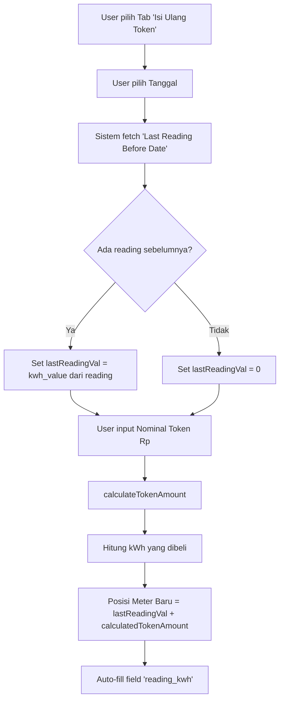

# Smart Pre-fill: Posisi Meter Baru (Prediksi)

Dokumentasi teknis untuk logika auto-fill "Posisi Meter Baru" saat mode Top-Up Token.

---

## Overview

Saat user melakukan **Top-Up Token**, website secara otomatis menghitung dan mengisi field "Posisi Meter Baru (Prediksi)" berdasarkan:

```
Posisi Meter Baru = Meter Terakhir + kWh yang Dibeli
```

---

## Alur Logic (Flow)



---

## Komponen Logic

### 1. Fetch Last Reading Before Date

Saat tanggal berubah, sistem mengambil **reading terakhir SEBELUM tanggal yang dipilih**:

```javascript
// useEffect triggered when: currentUser atau formData.date berubah
const selectedDate = formData.date; // tanggal yang dipilih user
const last = await getLastReadingBeforeDate(currentUser.id, selectedDate);

if (last) {
    const kwhVal = last.kwh_value || last.reading_kwh || 0;
    setLastReadingVal(kwhVal);
} else {
    setLastReadingVal(0); // Tidak ada reading sebelumnya
}
```

**Query Supabase:**
```sql
SELECT * 
FROM electricity_readings 
WHERE user_id = :userId 
  AND date < :selectedDate  -- Strictly BEFORE, ignores time
ORDER BY date DESC 
LIMIT 1
```

> [!IMPORTANT]
> Query menggunakan **DATE only** (YYYY-MM-DD), waktu diabaikan. 
> Jika user memilih 20 Desember, maka yang diambil adalah reading terakhir dari 19 Desember atau sebelumnya.

---

### 2. Calculate Token Amount (kWh dari Rupiah)

Saat user input nominal token (Rp), sistem menghitung estimasi kWh:

```javascript
// useEffect triggered when: formData.token_cost, activeTab, atau lastReadingVal berubah

if (formData.token_cost) {
    const numericCost = parseRupiah(formData.token_cost); // "100.000" → 100000
    
    if (numericCost > 0) {
        const calculated = await calculateTokenAmount(numericCost);
        // calculated = kWh yang didapat dari token Rp
    }
}
```

**Formula Kalkulasi kWh:**
```
kWh = (NominalToken - AdminFee - (NominalToken × TaxPercent / 100)) / TariffPerKwh
```

| Parameter | Sumber | Contoh |
|-----------|--------|--------|
| `NominalToken` | Input user | Rp 100.000 |
| `AdminFee` | Settings user | Rp 0 (biasanya 0 untuk prabayar) |
| `TaxPercent` | Settings user | 0% |
| `TariffPerKwh` | Settings user (berdasarkan golongan PLN) | Rp 1.444,70 (R1/1300VA) |

**Contoh:**
```
kWh = (100.000 - 0 - 0) / 1.444,70 = 69,22 kWh
```

---

### 3. Smart Pre-fill (Auto-fill Posisi Meter Baru)

Setelah mendapatkan `lastReadingVal` dan `calculatedTokenAmount`, sistem menghitung prediksi:

```javascript
// Inside useEffect for token calculation
if (activeTab === 'topup') {
    const projectedReading = lastReadingVal + calculated;
    
    setFormData((prev) => ({
        ...prev,
        token_amount: calculated.toFixed(2),      // kWh yang dibeli
        reading_kwh: projectedReading.toFixed(2)  // ← INI YANG AUTO-FILL
    }));
}
```

**Contoh Perhitungan:**

| Data | Nilai |
|------|-------|
| Meter Sebelumnya (`lastReadingVal`) | 0.00 kWh (user baru) |
| Token Dibeli (`calculatedTokenAmount`) | 69.22 kWh |
| **Posisi Meter Baru** | 0 + 69.22 = **69.22 kWh** |

---

## Trigger Conditions

Auto-fill **HANYA** terjadi ketika:

1. ✅ Mode aktif adalah `'topup'` (Tab "Isi Ulang Token")
2. ✅ `formData.token_cost` berubah (user input nominal)
3. ✅ `lastReadingVal` tersedia (dari fetch reading sebelumnya)

> [!NOTE]
> Jika user berada di mode `'record'` (Catat Pembacaan), auto-fill TIDAK aktif.

---

## Implementasi untuk Mobile

### Pseudocode

```kotlin
// 1. Saat tanggal berubah atau saat masuk screen Top-Up
fun onDateChanged(selectedDate: Date) {
    val lastReading = repository.getLastReadingBeforeDate(userId, selectedDate)
    lastReadingVal = lastReading?.kwhValue ?: 0.0
}

// 2. Saat nominal token berubah
fun onTokenCostChanged(tokenCostRp: Double) {
    val calculatedKwh = calculateTokenAmount(tokenCostRp)
    
    if (activeTab == TAB_TOPUP && calculatedKwh != null) {
        val projectedReading = lastReadingVal + calculatedKwh
        
        // Update UI
        tokenAmountField.value = calculatedKwh.toFixedString(2)
        meterReadingField.value = projectedReading.toFixedString(2)  // Auto-fill!
    }
}

// 3. Fungsi kalkulasi kWh
fun calculateTokenAmount(tokenCostRp: Double): Double? {
    if (tokenCostRp <= 0) return null
    
    val adminFee = userSettings.adminFee ?: 0.0
    val taxPercent = userSettings.taxPercent ?: 0.0
    val tariffPerKwh = userSettings.tariffPerKwh ?: 1444.70
    
    val taxAmount = (tokenCostRp * taxPercent) / 100
    val effectiveCost = tokenCostRp - adminFee - taxAmount
    
    return max(0.0, effectiveCost / tariffPerKwh)
}
```

---

## Data Flow Summary

| Step | Action | Data Source | Output |
|------|--------|-------------|--------|
| 1 | User pilih tanggal | UI Input | `selectedDate` |
| 2 | Fetch last reading | Supabase | `lastReadingVal` |
| 3 | User input nominal | UI Input | `tokenCostRp` |
| 4 | Calculate kWh | Local calculation | `calculatedTokenAmount` |
| 5 | Calculate prediction | `lastReadingVal + calculatedTokenAmount` | `projectedReading` |
| 6 | Auto-fill field | State update | UI updated |

---

## Checklist untuk Mobile Developer

- [ ] Implement `getLastReadingBeforeDate()` query dengan filter `date < selectedDate`
- [ ] Implement `calculateTokenAmount()` dengan formula yang benar
- [ ] Pastikan auto-fill hanya aktif di mode Top-Up
- [ ] Listen perubahan tanggal untuk re-fetch last reading
- [ ] Listen perubahan nominal token untuk re-calculate
- [ ] Handle case ketika tidak ada reading sebelumnya (`lastReadingVal = 0`)
- [ ] Tampilkan info "Meter Sebelumnya" dan "Jumlah Baru" seperti di website

---

## Perbedaan dengan Mode "Catat Pembacaan"

| Aspek | Catat Pembacaan | Isi Ulang Token |
|-------|-----------------|-----------------|
| Input utama | Posisi meter manual | Nominal Rupiah |
| Auto-fill meter | ❌ Tidak ada | ✅ Ya (prediksi) |
| Validasi | Reading baru < reading lama | Tidak ada validasi khusus |
| Label field | "Pembacaan Meter" | "Posisi Meter Baru (Prediksi)" |
